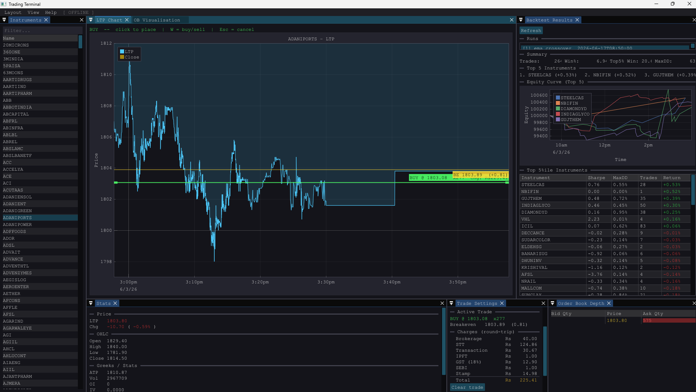
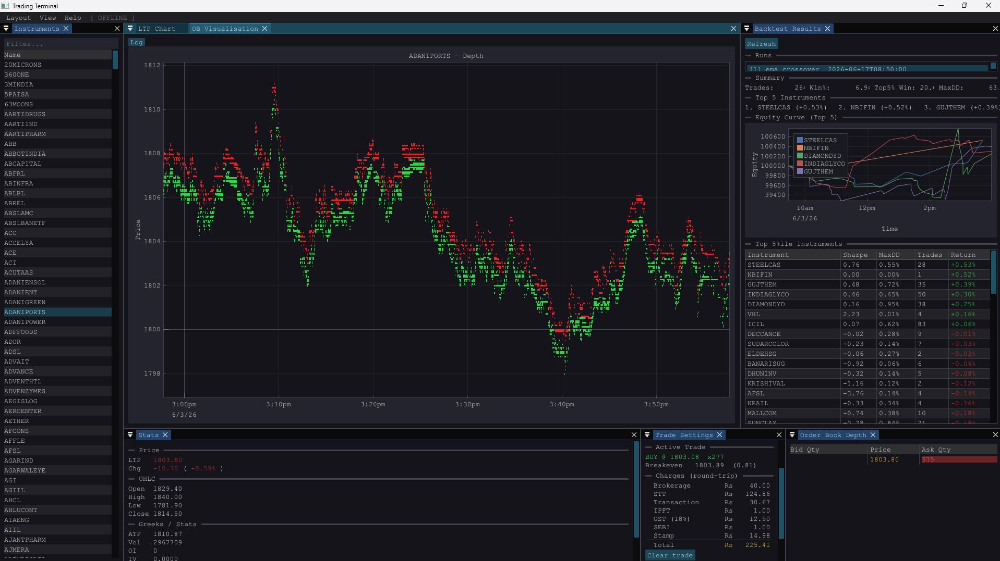

# Indian Markets Trading Toolkit

Real-time market data ingestion, storage, visualization, and backtesting for NSE/BSE instruments via the **Upstox V3 WebSocket API**.

---

|  |  |
|:--:|:--:|
| *Backtest results — per-instrument Sharpe, drawdown, win rate & equity curves* | *C++ terminal — live 5-level order book heatmap with LTP chart* |

---

## Features

### Live Data Ingestion
- Streams NIFTY / BANKNIFTY / SENSEX option chains and NSE MIS equities via Upstox MarketDataFeedV3 (protobuf)
- Full tick data: LTP, OI, IV, ATP, volume, 5-level order book (bid/ask), OHLC
- Batched writes (50 rows) to **SQLite WAL-mode** — low-latency, crash-safe
- Auto-watchdog (`run_stock_data.py`) restarts ingestion on crash
- Strike window filtering: ±5 strikes for options chain (configurable)

### Dual-DB Architecture
| DB | Source | Instruments |
|---|---|---|
| `market_data.db` | `full_data_to_sqlite.py` | NIFTY / BANKNIFTY / SENSEX options |
| `stock_data.db` | `stock_data_to_sqlite.py` | NSE MIS equities (intraday leverage=5) |

Both share the same schema with a full 5-level order book and instrument name lookup table.

### Backtesting Engine
- **Pluggable strategy interface** — subclass `Strategy`, implement `on_data(window: DataFrame) → int`
- Rolling tick window fed to strategy; signals converted to LONG/SHORT/HOLD trades
- Realistic simulation: configurable brokerage (%), slippage (%), position sizing (% of capital)
- **Parallel execution** across all instruments (multiprocessing, default = CPU count)
- Results written to `backtest_results.db`: run summary, per-instrument stats (Sharpe, max drawdown, win rate, return), equity curves for top performers

```bash
python run_backtest.py \
    --strategy strategies/example.py \
    --db stock_data.db \
    --date-from 2026-01-01 \
    --date-to   2026-06-01 \
    --capital   100000 \
    --out       backtest_results.db
```

### Example Strategy: EMA Crossover
`strategies/example.py` — 20/100 EMA crossover, ready to run or use as a template.

### Visualizers
- **PyQt6 GUI** (`gui_visualizer.py`) — Python-based live chart viewer using pyqtgraph
- **C++ terminal** (`visualiser/`) — Dear ImGui + ImPlot + GLFW/OpenGL3; reads `market_data.db` directly
  - Instrument list, LTP chart, OI/IV/ATP stats panel, live 5-level order book heatmap
  - Built with MSVC + vcpkg on Windows

### Auth
- OAuth2 PKCE flow via `tokgen.py` — opens Upstox login in browser, local server on `:2000` catches redirect
- `update_token.py` refreshes token once per day automatically

### Utilities
- `map_instruments.py` — seeds `instrument_names` table from `complete.json` / `nse_mis_instruments.json`
- `inspect_db.py` — prints active schema + sample row
- `merge_dbs.py` — merges old and new schema DBs
- `test_bsm*.py` / `test_delta.py` — Black-Scholes / delta validation scripts

---

## Quick Start

```bash
# 1. Install deps
pip install -r requirements.txt

# 2. Auth (once per day)
python update_token.py

# 3. Seed instrument names
python map_instruments.py

# 4. Start ingestion
python full_data_to_sqlite.py        # options chains
python run_stock_data.py             # equities (with watchdog)

# 5. Run a backtest
python run_backtest.py --strategy strategies/example.py --db stock_data.db

# 6. Launch C++ visualizer (Windows)
cd visualiser
cmake -B build -DCMAKE_TOOLCHAIN_FILE="$env:VCPKG_ROOT/scripts/buildsystems/vcpkg.cmake" -DVCPKG_TARGET_TRIPLET=x64-windows
cmake --build build --config Release
.\build\Release\trading_terminal.exe ..\market_data.db
```

---

## Stack

| Layer | Tech |
|---|---|
| Feed | Upstox MarketDataFeedV3 (protobuf over WebSocket) |
| Storage | SQLite (WAL, synchronous=NORMAL) |
| Python | requests, websockets, protobuf, pandas, numpy, scipy, PyQt6, pyqtgraph |
| C++ visualizer | Dear ImGui, ImPlot, GLFW, OpenGL3, SQLite (vcpkg) |

---

## Secrets
- `secrets.json` — `client-id`, `client-secret`
- `accesstoken.json` — daily OAuth token
